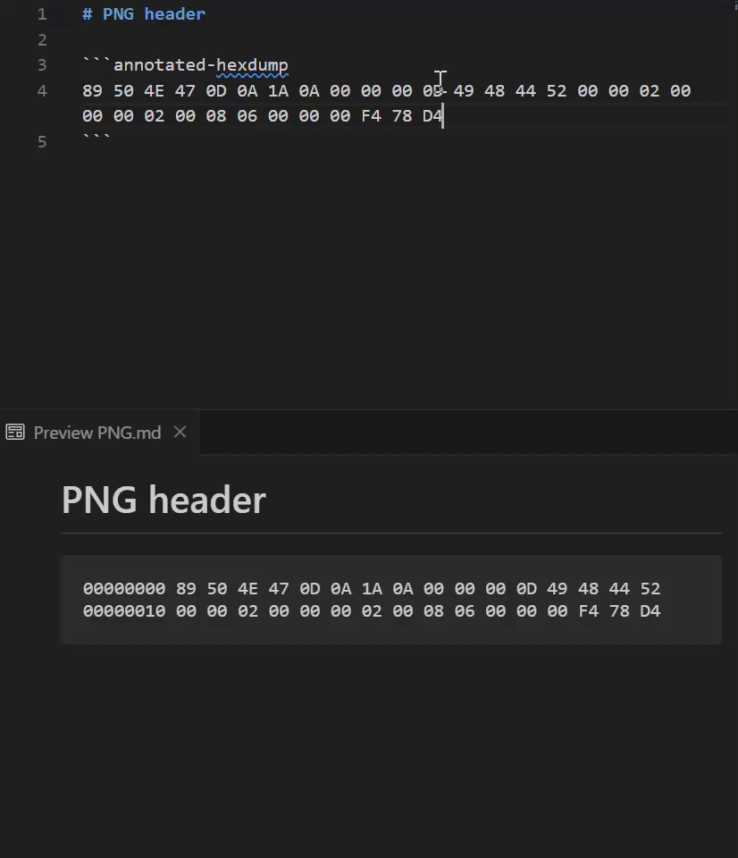

# md-annotated-hexdumps README

Adds support for annotated hexdumps, driven by the the [marked-annotated-hexdump](https://www.npmjs.com/package/marked-annotated-hexdump) library. This allows you to add highlighted regions to hexdumps, and control how they are displayed.

## Syntax

Simply create a markdown code block with the language set to `annotated-hexdump`, and use the following commands:

- `/highlight [0:3,6] /0` will highlight a bytes 0-3 inclusive and 6, using highlight color 0.
  There are 16 highlight colors.
- `/awidth 8` will display the addresses using 8 bytes instead of the default 4. You can use any value between 2 and 8.
- `/width 4` will display 4 bytes of data per line, instead of the default 16. You can use any value between 2 and 32.
- `/case upper` or `/case lower` can be used to control the case of the output hexdump. Defaults to uppercase.
- `/missing ?` will replace missing bytes with `??`. Defaults to whitespace.
- `/note /0 Header bytes` will place the note `Header bytes` after the hexdump, highlighted with color 0.

More documentation of the syntax is provided at [marked-annotated-hexdump](https://www.npmjs.com/package/marked-annotated-hexdump).

You can use the [playground](https://danishcake.github.io/marked-annotated-hexdump/markdown-it/) to play with the syntax without installing anything.
