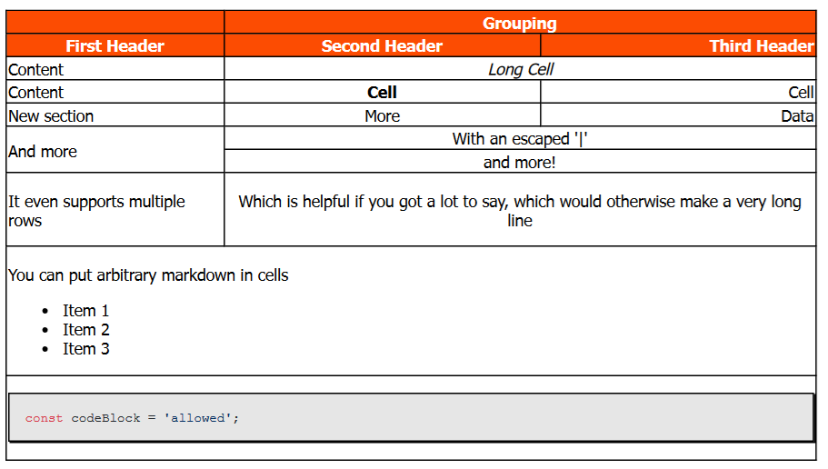

# md-annotated-hexdumps README

Adds support for multimark tables, driven by the the [markdown-it-multimd-table](https://www.npmjs.com/package/markdown-it-multimd-table) library.
This allows you to add complex tables, with spanned rows and columns, or define tables over multiple rows.

## Syntax

<!-- prettier-ignore-start -->
````markdown
|               |          Grouping           ||
| First Header  | Second Header | Third Header |
| ------------- | :-----------: | -----------: |
| Content       |          *Long Cell*        ||
| Content       |   **Cell**    |         Cell |
| New section   |     More      |         Data |
| And more      | With an escaped '\|'        ||
|^^             | and more!                   ||
| It even       | Which is helpful if you got || \
| supports      | a lot to say, which would   || \
| multiple rows | otherwise make a very long  || \
|               | line                        ||
| You can put arbitrary markdown in cells    ||| \
| - Item 1                                   ||| \
| - Item 2                                   ||| \
| - Item 3                                   |||
| ```typescript                              ||| \
| const codeBlock = 'allowed';               ||| \
| ```                                        |||
````
<!-- prettier-ignore-end -->


